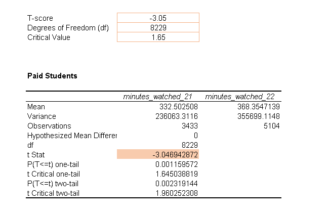
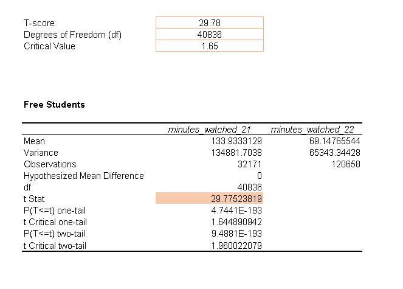

# 365 Platform — Student Engagement Analysis (Q4 2021 vs Q4 2022)

**Tools:** Excel · Descriptive Statistics · Hypothesis Testing  
**Focus:** Low-engagement users (1–100 minutes in 2021) · Free vs Paid users · US vs India comparison

This project analyzes whether new gamification features (XP system, streaks, leaderboards, in-app coins) led to higher student engagement between **Q4 2021** and **Q4 2022**.

---

## 📊 Key Insights (from the raw dataset)

### **Paid-plan low-engagement users**
- **Mean:** 33.8 → 273.0  
- **Median:** 26.3 → 40.3  
- **Std deviation:** 28.2 → 854.6  
**Insight:** Strong improvement. Massive SD increase shows many students returned with extremely high usage in 2022.

### **Free-plan low-engagement users**
- **Mean:** 25.4 → 117.6  
- **Median:** 14.2 → 11.8  
- **Std deviation:** 26.2 → 468.9  
**Insight:** Mean increases sharply, but median decreases — a strongly right-skewed distribution with heavy outliers.

---

## ✔️ Statistical Tests (Summary)

- Two-sample **t-tests (unequal variances)** show **significant** increase in 2022 minutes for both free and paid students.  
- Skewness & kurtosis confirm **heavy right skew and high kurtosis**, especially in 2022.  
- Regional comparison (US vs India, 2022 free users) indicates **India has slightly higher average minutes watched**.  
- Confidence intervals show wider spread in 2022 due to extreme high-engagement students.

---

## 📁 Files in This Repository

- **Engagement Project.xlsx** — Raw dataset for all tasks.  
- **/images** — Contains screenshots of:
  - Descriptive statistics (2021 & 2022)
  - Confidence intervals
  - T-test results (paid/free)
  - Regional test (US vs India)

---

## 🖼️ Screenshots


```markdown



```

---

## 🔍 How to Reproduce (Excel Workflow)

1. Filter students with `minutes_watched_21` between **1 and 100**.  
2. Split into **paid (1)** and **free (0)** groups.  
3. Calculate:
   - `AVERAGE()`
   - `MEDIAN()`
   - `STDEV.S()`
   - `SKEW()`
   - `KURT()`
4. Build 95% confidence intervals:  
   `mean ± T.INV.2T(0.05, df) * (sd / SQRT(n))`
5. Run **t-tests (unequal variances)** for:
   - 2021 vs 2022 (paid)
   - 2021 vs 2022 (free)
   - US vs India (free, 2022)

---

## 📌 Conclusion

- Engagement increased for both **paid** and **free** low-engagement users in 2022.  
- Paid users showed the **strongest and most consistent** improvement.  
- Free users' improvement was driven by a handful of very active students (right-skewed).  
- Statistical evidence suggests the platform’s new gamification features **positively impacted engagement**.  
- Regional insights indicate opportunities for **India-focused content and localization**.

---

## ⭐ Author
Analysis performed using Excel on the official engagement dataset.  
Screenshots and raw dataset included for reproducibility.


